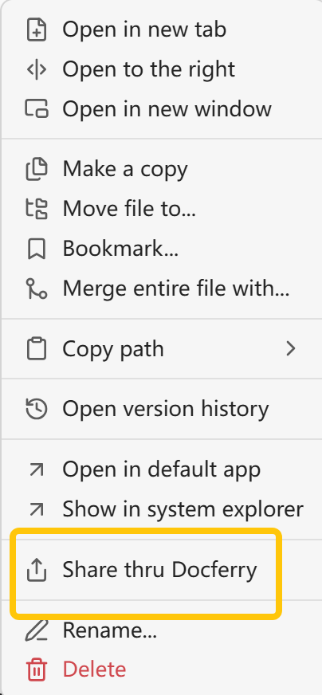
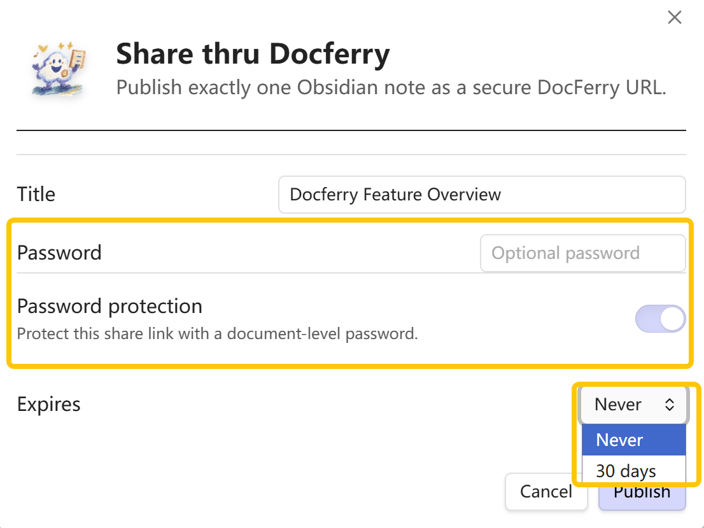
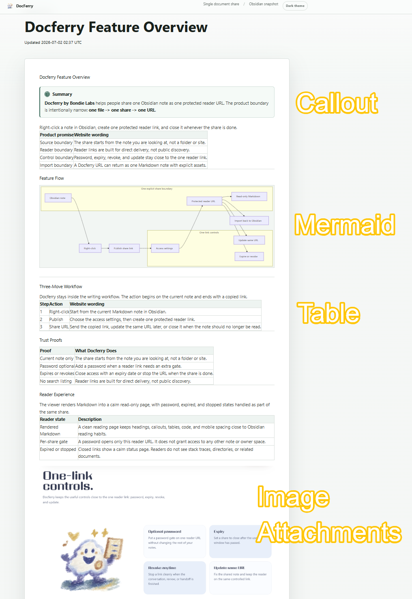
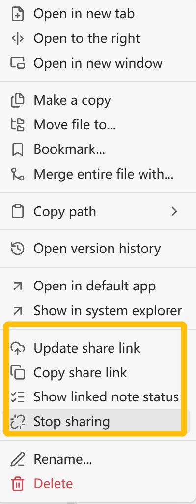
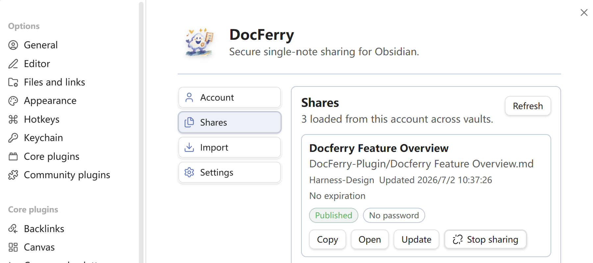
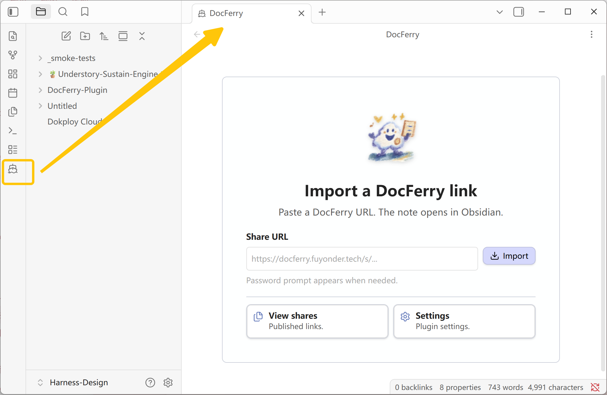

<p align="center">
  
</p>

<h1 align="center">DocFerry</h1>

<p align="center">
  Share one Markdown note as one secure DocFerry URL, then update or revoke that same link whenever the note changes.
</p>

DocFerry is built for focused single-note sharing. It does not publish an entire folder, vault, digital garden, or public directory. The product boundary is simple:

```text
one selected note -> one secure share URL
```

Referenced images and attachments can be shared together with the note in the same publish action. You do not need to upload each attachment separately, which makes DocFerry convenient for single-note handoffs when a full Obsidian Publish site would be too broad.

Live preview: [DocFerry Feature Overview](https://docferry.fuyonder.tech/s/Gt5Wy3pwzY)

## Share A Note

Right-click a Markdown note and choose `Share thru Docferry`.

<p align="center">
  
</p>

DocFerry opens a publish dialog for the selected note. You can confirm or edit the title, optionally add a password, and choose whether the link never expires or expires after 30 days.

<p align="center">
  
</p>

After publishing, the share URL is copied for you.

## Reader Experience

The shared page is a calm read-only page that keeps everyday note structure close to the source note. Callouts, Mermaid diagrams, tables, and image attachments are rendered in the reader view, with wide content adapting to the available page width.

<p align="center">
  
</p>

DocFerry shares the current note and explicitly referenced local assets. Linked notes are not uploaded unless you publish them separately.

## Update Or Revoke

When a note has already been published, its right-click menu changes. You can update the content behind the same link, copy the existing link, inspect linked-note status, or stop sharing.

<p align="center">
  
</p>

- `Update share link` refreshes the published content without creating a new URL.
- `Copy share link` copies the current reader URL.
- `Show linked note status` shows which internal note links are available to readers.
- `Stop sharing` revokes the link. After revocation, the URL no longer serves the note.

## Manage Shares

Open the plugin settings to manage published links from the `Shares` section. The list shows published documents for the connected account, including their source path, update time, expiration state, password state, and actions such as copy, open, update, and stop sharing.

<p align="center">
  
</p>

## Import A DocFerry Link

After installing and enabling the plugin, use the DocFerry ribbon icon to open the DocFerry view. Paste a DocFerry URL and click `Import`; the note is saved into this vault as a local Markdown file. If the share is password-protected, the password prompt appears when needed.

<p align="center">
  
</p>

Import reads one DocFerry share URL at a time. It does not scan the sender's vault, crawl unrelated folders, or import unpublished linked notes.

## Account And Quota

- Hosted service: `https://docferry.fuyonder.tech`
- Account system: Fuyonder account
- Free quota: connected accounts receive a free 5-document quota from the hosted service
- More quota: users can request extra free quota from the beta list flow in settings
- Billing: public billing controls are not active in the plugin UI
- Legal pages: hosted service provides `https://docferry.fuyonder.tech/privacy` and `https://docferry.fuyonder.tech/terms`
- Versioning: the GitHub release tag, root `manifest.json`, and `plugin/manifest.json` must match

If paid access or hosted-service billing is enabled later, update the README, privacy notice, release notes, product UI copy, and review evidence in the same release.

## Privacy Boundary

DocFerry does not upload your vault automatically. When a user publishes, DocFerry can upload the selected note, rendered HTML snapshot, bounded CSS snapshot, explicitly referenced local assets, and share metadata needed to serve the link.

Read [PRIVACY.md](PRIVACY.md) before publishing sensitive notes.

## Manual Install

Use the latest GitHub Release and copy the plugin files into:

```text
.obsidian/plugins/docferry/
```

Required runtime files:

```text
manifest.json
main.js
styles.css
```

GitHub releases should attach only the assets that Obsidian downloads: `manifest.json`, `main.js`, and `styles.css`.

## Build

From a clean checkout:

```bash
npm ci
npm --prefix plugin ci
npm run check:plugin
```

Plugin-only build:

```bash
cd plugin
npm ci
npm run build
node --check main.js
```

## Release Review Notes

- `manifest.json` is mirrored at the repository root for Obsidian review.
- `plugin/manifest.json` is the runtime manifest included in the installable plugin package.
- `package.json` and `tsconfig.json` at the repository root exist so automated review tools can resolve Obsidian, CodeMirror, and runtime SDK types in this plugin-subdirectory layout.
- The plugin is desktop-only because this release targets desktop Obsidian plugin packaging.
- The manifest description intentionally avoids the word "Obsidian"; the Community directory already provides that context.
- The GitHub release tag, root `manifest.json`, and `plugin/manifest.json` must match.
